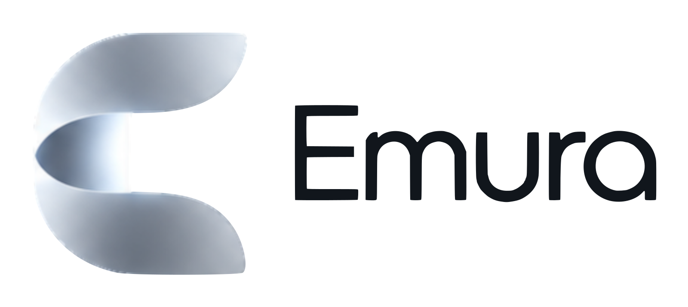

  <picture>
    <source media="(prefers-color-scheme: dark)" srcset="assets/logo-light-text.png">
    
  </picture>

  <b>The Game Boy, Game Boy Color, Game Boy Advance, DS and 3DS games you own, at home on your iPhone.</b>

  <a href="https://nico8324.github.io/emura/">Help</a> ·
  <a href="https://github.com/Nico8324/emura/issues/new/choose">Report a problem</a> ·
  <a href="https://github.com/Nico8324/emura/discussions">Questions &amp; ideas</a> ·
  <a href="https://nico8324.github.io/emura/privacy.html">Privacy</a>

---

This repository is Emura's home for support: help pages, problem reports and discussions. The app itself is coming to the App Store.

## Get help

| | |
|---|---|
| ❓ **Questions people ask** | [Read the FAQ](https://nico8324.github.io/emura/faq.html) |
| ✉️ **Email** | [emura.support@icloud.com](mailto:emura.support@icloud.com), for anything, including private matters |
| 🎮 **A game doesn't run right** | [Report it](https://github.com/Nico8324/emura/issues/new?template=1-game.yml): which game, which iPhone, what you saw |
| 🐞 **Something in the app is wrong** | [Report a bug](https://github.com/Nico8324/emura/issues/new?template=2-bug.yml) |
| 💬 **A question** | [Ask in Q&A](https://github.com/Nico8324/emura/discussions/categories/q-a) |
| 💡 **An idea** | [Suggest it](https://github.com/Nico8324/emura/discussions/categories/ideas), or vote for one with 👍 |

> [!IMPORTANT]
> Emura doesn't come with games. Play the games you own, and **never share game files, BIOS files or links to them** here. Posts that do are deleted.

## Emura

- **Five consoles, one app:** Game Boy, Game Boy Color, Game Boy Advance, DS and 3DS, on their own emulators written for the iPhone.
- **Your library, looking its best:** each game's real box, title screen and screenshot, its details and, for DS and 3DS games, a description in six languages.
- **Pick up where you left off:** Play reopens every game where you stopped.
- **Play your way:** game controllers and keyboards, and skins made for Delta (.deltaskin), free.
- **The consoles' own tricks:** the DS's lid and two screens, and the 3DS's camera, microphone, motion and step counter.
- **Every system plays free.** Supporters get save states, faster fast forward, their iPhone's colors and Screen Light.
- **Nothing about you leaves your iPhone:** no account, no ads, no tracking. [Privacy policy](https://nico8324.github.io/emura/privacy.html).

## Thanks

Emura's library uses game art and details from [libretro-thumbnails](https://github.com/libretro-thumbnails), [libretro-database](https://github.com/libretro/libretro-database) (No-Intro, CC BY-SA 4.0), [GameTDB](https://www.gametdb.com) and, with your own key, [SteamGridDB](https://www.steamgriddb.com). Thank you to everyone who scans, captures, draws and writes all of this for free. Pictures and descriptions of games belong to their owners.

Emura is not affiliated with or endorsed by any console maker. Its name and logo are its own.

